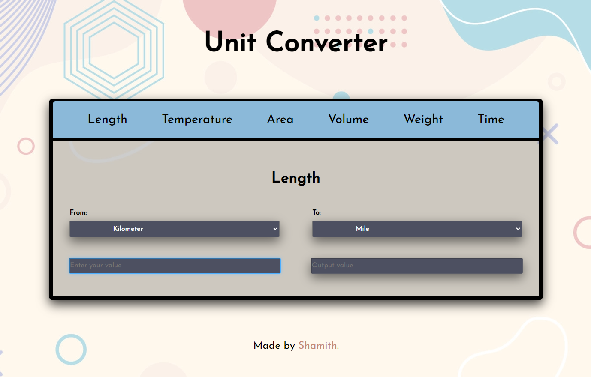

# UnitConversion 

<br>
<div align="center">

[](https://github.com/iamwatchdogs?tab=repositories&q=&type=public&language=html&sort=)
[](https://github.com/iamwatchdogs?tab=repositories&q=&type=public&language=css&sort=)
[](https://github.com/iamwatchdogs?tab=repositories&q=&type=public&language=javascript&sort=)


<br>

[](https://github.com/iamwatchdogs?tab=repositories&q=&type=public&language=&sort=)
[](https://github.com/iamwatchdogs/UnitConversion/pulls)
[](https://github.com/iamwatchdogs/UnitConversion/issues)
[](https://github.com/iamwatchdogs/UnitConversion.js/pulls?q=is%3Amerged)
[](https://GitHub.com/iamwatchdogs/UnitConversion/releases/)
[](https://opensource.org/licenses/Apache-2.0)

</div>
<br>


I recently completed a challenging and exciting front-end project as part of my web development internship at Codeclause. The project, called UnitConversion, is a simple website that can do unit conversion of lenght, temperature, volume, area, weight, and time. The project was built using a simple yet powerful combination of pure HTML, CSS, and javascript, also known as "villain javascript." Through this mini-project, I gained valuable hands-on experience with this cutting-edge technology and honed my web development skills.


Working on the [UnitConversion](https://github.com/iamwatchdogs/UnitConversion "Goto Original Project") project was an incredible experience. It allowed me to showcase my creativity and problem-solving skills by developing a sleek and functional website that serves a practical purpose. I was challenged to implement responsive design principles to ensure the website looks great on all devices, and to leverage the power of javascript to create smooth and seamless user experiences.

In the end, I'm thrilled with the result and can't wait to apply the lessons I've learned to future web development projects.

## Contribution:

Even though this was a small task of my internship, I think we take take it to next level. If you're a beginner and don't understand what contributing is... then hear me out, Contributing is a process where you wish to work on others' projects to implement your idea *(or)* fix errors to help/support others and improve your practical knowledge in that field. Contributing to an Open-Source such as this mini-project can help you in the long run of your technical journey. You can check [CONTRIBUTION.md](CONTRIBUTION.md "Let's go to CONTRIBUTION.md") for a more practical explanation.

To contribute to **this** repository, You need to have a good grip on the following skills:

- ***GitHub**. 

  > You need to have a basic understanding of how GitHub works.
  
- ***Git**.

  > Git acts as the local Version control and helps you connect your system with GitHub.
  
- ***Vanilla JavaScript**.

  > Vanilla JavaScript is a combination of pure HTML, CSS, and JavaScript.
  
- Other tech skills.

  > If you wish to integrate other languages, libraries, or frameworks.

You can get started by forking this repo and cloning it into your system. Here are some of the git commands you'll be using,

```bash
# Clone your forked repo into your local system
git clone https://github.com/<Your-GitHub-Name>/LoanApprovalPredictionModel_Website.git

# Creating a new branch
git checkout -b <branch-name>

# Adding all the elements/changes into tracked/staged state
git add .

# Committing your every change
git commit -m "<message>"

# Updating your remote repo (or) pushing your commits to your forked repo
git push origin <branch-name>
```

After you're done with your changes, you can push them back to your remote repository. So that you can send me a pull request to merge the changes into the original Repository.

> Sounds too Complicated ???... Don't worry, checkout the beginner-friendly guide on how to contribute to this repo on [CONTRIBUTION.md](CONTRIBUTION.md "Let's goto CONTRIBUTION.md")

## Final Output:

<div align="center">



</div>
